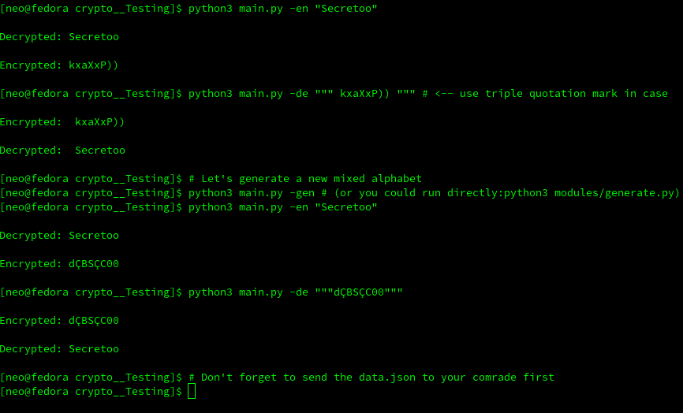

## What This Program Does?
Convert your ***secret*** text to random letters and symbols, and convert this random letters & symbols back to normal text using a simple [.json dictionary](https://github.com/1RaY-1/crypto/blob/main/data.json).

Let's say you wanna send something to your whatsapp group but only 1 person's allow to see it, so you can **ecnrypt** your message using this program and send it there and only your partner can see what you've send, because you both have **the same data.json file**

You can also encrypt with base64 the data.json to key.txt before sending it to your partner (idk if this was necessary) and decrypt key.txt to data.json
To do so:
```
Encrypt data.json to key.txt (using base64)
python3 modules/key_manager -en

Decrypt key.txt into data.json
python3 modules/key_manager -de
```

## Requirements & Supported OS
This program works on **Windows**, **Linux**, **Android** (Using [Termux](https://termux.dev)), **iOS** (using [iSH](https://ish.app/))

You need to have **Python** installed in your system.
## Hot to use it?
```
python3 main.py [OPTION] """YOUR-TEXT""" 

Example:
* Encrypt a text
python3 main.py -en "Hello, World"

Options:
1: ['g', '-g', 'gen', '-gen', '--generate-key'] <-- Generate a new crypto alphabet

2: ['d', '-d', 'de', '-de', '--decrypt'] <-- Decrypt a text

3: ['e', '-e', 'en', '-en', '--encrypt'] <-- Encrypt a text

More:
- Module files can be run directly from terminal (using: python3 modules/[MODULE-FILE].py)

```

## Example, Screenshot

<br>
<p align="center">

</p>


## Logs
By default this program will generate logs of "when" and "what" text you've encrypted/decrypted, in the base folder, in logs.txt

But you can disable it, in [main.py](https://github.com/1RaY-1/crypto/blob/main/main.py) on line 33: change **True** to **False**


### More
It's not a super program, but still, I think it's a cool idea.
